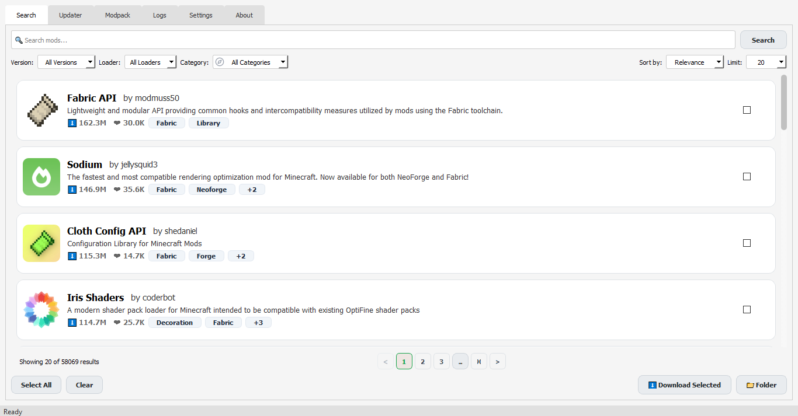
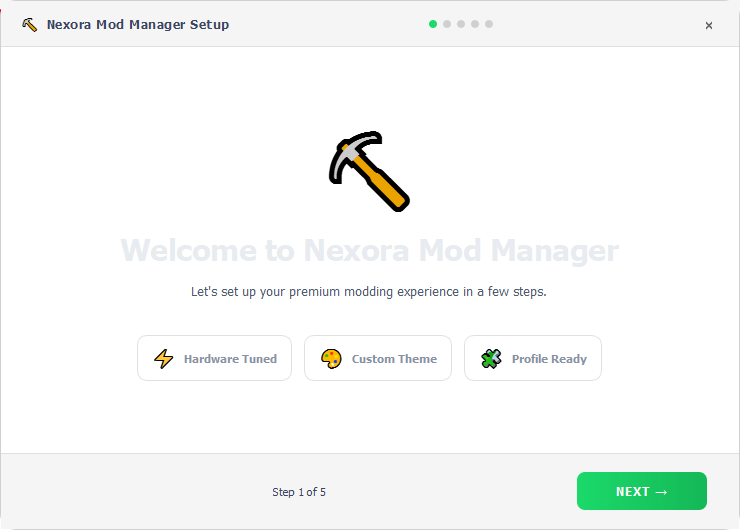

# Nexora Mod Manager

## Why I made it:

I play Minecraft and when Minecraft has an update I have to download Minecraft mods for that Minecraft version so I can keep playing Minecraft with the updates. The thing is it takes a long time to do this and it can be really frustrating. I look for an application that can help me with this. I do not find any application that does this. This is why I decided to make this application, for Minecraft player to make their life easy.

## Screenshots
<!-- SEARCH TAB SCREENSHOT -->

## Features

### Core Features

* **Find mods quickly**. You can search for mods on Modrinth and it will show you the results away.
* **Get mods with one click**. This makes it easy to download and manage your mods.
* **Manage your mods easily**. You can look at all your mods organize them and update them when you need to.
* **The right version every time**. Nexora makes sure you get the version of the mod that works with your Minecraft version.
* **Keep your mods organized**. All your mods are sorted out and easy to find.
* **It works fast and does not slow down your computer**. Nexora is made to be fast and not use up much memory.
  
### Mod Loader Support
* **Fabric**. We fully support Fabric mods.
* **Forge**. You can use Forge mods without any issues.
* **NeoForge**. Our support for NeoForge mods is complete.
* **Quilt**. We offer support for Quilt mods.
* **Legacy Forge**. Older Forge versions are also supported.

## Installation

<!-- INSTALLER / SETUP WIZARD SCREENSHOT -->

### Prebuilt Executable (Recommended)

1. Get `Nexora.exe` from the [ release](https://github.com/PoGamerLab/Modrinth-Mods-Manager/releases).
2. Run the application.
3. Follow the setup wizard.
4. Start managing your mods.

## System Requirements

* **OS:** You need Windows 10 or Windows 11.
* **Internet:** A connection is required for downloading and updating mods.
* **Storage:** Ensure you have 100MB+ free for the application, plus extra space for mods.
* **RAM:** 2GB is the minimum. 4GB is recommended.

## Storage Location

By default Nexora stores its data, settings and cache in:
- **Windows:** "AppData\Roaming\Nexora"

## Configuration

<!-- SETTINGS TAB SCREENSHOT -->

Nexora has several configuration options:
- **Theme selection**. Choose between light mode.
- **Mod folder path**. Pick a custom directory for your mods.
- **Download settings**. Set speed limits and retry counts.
- **Update preferences**. Decide if you want manual updates.
- **Performance mode**. Use a low-end mode for systems.
- **Cache settings**. Manage image cache size and disk limits.

## License

All rights are reserved. Nexora is proprietary unless stated otherwise.

## Author

Created by PoGamerLab.

## Support the Project!

If you like Nexora Mod Manager share it. Help future updates.

## Contributing

This project is personal. For bugs or features open an issue, on GitHub.
